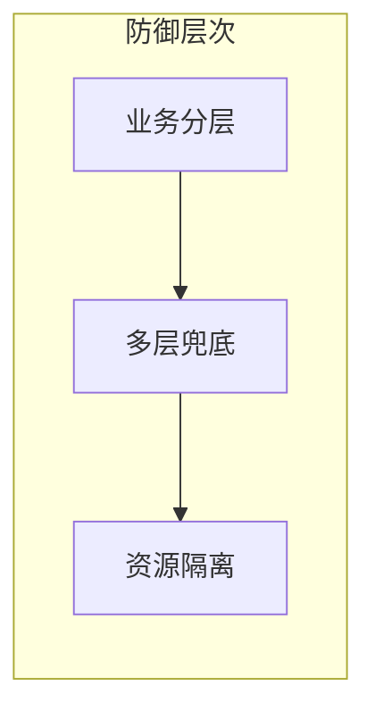

# Vertoscribe

> *vertere*（拉丁语：转化）+ *scribere*（拉丁语：书写）— 将视频转化为文字。

[](https://www.python.org/downloads/)
[](LICENSE)
[](https://github.com/psf/black)

**一条命令，教学视频变高质量技术博客。**

## 快速开始

```bash
# 安装
pip install -e .

# 设置 API 密钥
export DEEPSEEK_API_KEY="sk-xxx"
export DASHSCOPE_API_KEY="sk-xxx"  # 可选，--with-vision 时需要

# 从 B 站视频生成博客
vertoscribe -u "https://www.bilibili.com/video/BV1xx411c7mD" -o ./output/

# 从抖音分享链接生成（无需登录/cookie）
vertoscribe -u "https://v.douyin.com/xxxxxxx/" -o ./output/

# 从本地 mp4 生成
vertoscribe -f ./tutorial.mp4 -o ./output/

# 开启画面分析
vertoscribe -f ./tutorial.mp4 -o ./output/ --with-vision
```

## 功能

- 🎥 支持 B站（yt-dlp）、抖音（内置 Web API 解析，无需登录）视频链接，也可使用本地 mp4 文件
- 🎙️ faster-whisper 本地语音转录，数据不出本机，隐私安全
- 🤖 多 LLM 后端支持：DeepSeek / OpenAI / Ollama / Qwen
- ✍️ 文风重写 pass（默认开启）：初稿生成后做一次"去 AI 味"重写，消灭模板感与套话
- 📊 Mermaid 图表自动生成（流程/时序/架构/竞态），语法兼容掘金等旧版渲染器
- 🚀 掘金发布优化：标题 ≤40 字、摘要 ≤100 字、主流标签、文末互动问题，报告附发布建议包
- 🖼️ 可选画面关键帧分析（Qwen-VL），图片内容入文
- ✅ 写作规范自动检查（摘要/收尾/禁用词/代码块标注/frontmatter/mermaid 兼容/段落节奏/互动引导，共 9 项）
- 📝 内置 8 种技术博客类型模板（教程/深度解析/架构设计/基准对比/工具评测/问答体/踩坑复盘/方案对比）
- 💾 转录缓存：SHA256 哈希，避免重复转录
- 💰 成本透明：纯音频两次 LLM 调用（合成+重写）约 ¥0.02/篇，含画面约 ¥0.17/篇（`--no-rewrite` 可减半）
- 🧹 临时文件自动清理，支持 `--keep-temp` 调试模式接口

## 安装

### 系统要求

- Python 3.10+
- ffmpeg（音频提取）

### 安装步骤

```bash
# 安装 ffmpeg（按平台选择）
brew install ffmpeg          # macOS
sudo apt install ffmpeg      # Linux
winget install ffmpeg        # Windows（或从 https://ffmpeg.org 下载）

# 克隆仓库
git clone https://github.com/animacaeli/vertoscribe.git
cd vertoscribe

# 安装 Python 依赖
pip install -e ".[dev]"
```

### 前置检查

运行前确保以下工具可用：

| 工具 | 用途 | 安装方式 |
|------|------|----------|
| ffmpeg | 音频提取 | `brew install ffmpeg` / `apt install ffmpeg` |
| ffprobe | 视频文件校验 | 随 ffmpeg 附带 |
| yt-dlp | B站视频下载 | `pip install yt-dlp`（仅 B站链接需要，抖音走内置解析） |
| DEEPSEEK_API_KEY | 博客合成 | [DeepSeek 开放平台](https://platform.deepseek.com/) 获取 |
| DASHSCOPE_API_KEY | 画面分析 | [DashScope](https://dashscope.aliyun.com/) 获取（仅 `--with-vision` 时需要） |

## 使用方法

### 命令行参数

| 参数 | 类型 | 默认值 | 说明 |
|------|------|--------|------|
| `-u, --url` | string | — | 视频在线链接（仅支持抖音/B站），必须用引号包裹 |
| `-f, --file` | string | — | 本地 mp4 文件路径 |
| `-o, --output` | string | `./output/` | 博客输出目录 |
| `-m, --model` | string | `LLM_MODEL` 环境变量，未设置则 `deepseek-chat` | LLM 模型名 |
| `--provider` | string | `deepseek` | LLM 提供商：deepseek/openai/ollama/qwen |
| `--api-base` | string | — | 自定义 LLM API 端点（优先级高于 --provider） |
| `-t, --temperature` | float | `0.7` | LLM 生成温度（0-2） |
| `--max-tokens` | int | `8192` | LLM 输出最大 token 数 |
| `--with-vision` | flag | false | 开启画面关键帧分析（需 DashScope API） |
| `--no-rewrite` | flag | false | 跳过文风重写 pass（默认开启：初稿生成后额外做一次去 AI 味重写） |
| `--vision-model` | string | `qwen-vl-plus` | 视觉模型，可升级 `qwen-vl-max` |
| `--frame-interval` | int | `10` | 关键帧提取间隔（秒），仅 `--with-vision` 时生效 |
| `--no-cache` | flag | false | 跳过转录缓存，强制重新转录 |
| `--keep-temp` | flag | false | 保留中间文件（调试用） |
| `-v, --verbose` | flag | false | 打印详细日志 |

> `-u` 和 `-f` 二选一，必须指定其中一个。

### 环境变量

| 变量 | 必需 | 说明 |
|------|------|------|
| `DEEPSEEK_API_KEY` | 是 | DeepSeek API 密钥 |
| `DASHSCOPE_API_KEY` | 否 | 阿里云 DashScope API 密钥（`--with-vision` 时需要） |
| `LLM_MODEL` | 否 | LLM 模型名，默认 `deepseek-chat`，可被 `-m` 参数覆盖 |
| `WHISPER_MODEL` | 否 | Whisper 模型名，默认 `base`。可选 `tiny` / `small` / `medium` / `large-v3` |
| `BILIBILI_COOKIE` | 否 | B站 cookie 文件路径，用于下载高清/大会员视频 |

也可以在项目根目录创建 `.env` 文件：

```bash
DEEPSEEK_API_KEY="sk-xxx"
DASHSCOPE_API_KEY="sk-xxx"
LLM_MODEL="deepseek-flash"
WHISPER_MODEL="small"
```

### 常见用法

```bash
# 最简用法：从 B 站链接生成
vertoscribe -u "https://www.bilibili.com/video/BV1xx411c7mD"

# 从抖音分享链接生成（无需登录/cookie）
vertoscribe -u "https://v.douyin.com/xxxxxxx/"

# 从本地文件生成并指定输出目录
vertoscribe -f ./lecture.mp4 -o ./blogs/

# 跳过文风重写（只要初稿，LLM 成本减半）
vertoscribe -u "https://v.douyin.com/xxxxxxx/" --no-rewrite

# 开启画面分析 + 详细日志
vertoscribe -f ./tutorial.mp4 --with-vision -v

# 使用更大 Whisper 模型提升转写精度
export WHISPER_MODEL="medium"
vertoscribe -u "https://www.bilibili.com/video/BV1xx411c7mD"

# 调整 LLM 温度和输出长度
vertoscribe -f ./video.mp4 -t 0.5 --max-tokens 4096
```

## 工作原理

```
┌──────────────────────────────────────────────────────────────────────┐
│                           vertoscribe 流程                            │
├──────────────────────────────────────────────────────────────────────┤
│                                                                       │
│  ┌──────────┐   ┌──────────┐   ┌──────────┐   ┌───────────┐        │
│  │ 1. 输入  │──▶│ 2. 校验  │──▶│ 3. 音频  │──▶│ 4. 转录   │        │
│  │ 下载/本地│   │ ffprobe  │   │ 提取     │   │ faster-   │        │
│  │ mp4      │   │ 格式检查 │   │ ffmpeg   │   │ whisper   │        │
│  └──────────┘   └──────────┘   └──────────┘   └───────────┘        │
│                                                      │               │
│                                                      ▼               │
│  ┌──────────┐   ┌──────────┐   ┌──────────┐   ┌───────────┐        │
│  │ 7. 保存  │◀──│ 6. 后处理│◀──│ 5. 合成  │◀──│ 转录文本  │        │
│  │ .md 报告 │   │ 9 项检查 │   │ + 重写   │   │ + 画面描述 │        │
│  │ + 缓存   │   │ 评分警告 │   │ LLM×2    │   │ (可选)     │        │
│  └──────────┘   └──────────┘   └──────────┘   └───────────┘        │
│                                                                       │
└──────────────────────────────────────────────────────────────────────┘
```

1. **输入准备**：B站链接用 yt-dlp 下载，抖音链接走内置 Web API 解析（a_bogus 签名，无需登录），本地模式直接使用文件路径
2. **视频校验**：ffprobe 检查是否为有效视频文件
3. **音频提取**：ffmpeg 提取 16kHz 单声道 PCM wav
4. **语音转录**：faster-whisper 本地转写为带时间戳的文本段落（Apple Silicon 自动适配 `compute_type`）
5. **博客合成 + 文风重写**：转录文本注入 LLM 生成初稿（结构/图表/文风约束见 `prompts/blog_synthesis.md`），随后默认再做一次"去 AI 味"重写 pass（保留技术事实，重写表达；`--no-rewrite` 跳过）
6. **后处理检查**：9 项写作规范检查（摘要形式与长度、收尾段落、禁用词、代码块语言标注、frontmatter 与标题长度、mermaid 图表与掘金兼容性、段落节奏、互动引导），评分并输出警告
7. **保存输出**：写入 `.md` 文件与 `*_report.json` 评估报告（含掘金发布建议 `publish` 字段），清理临时文件（可通过 `--keep-temp` 保留）

## 输出示例

生成的 `output/` 目录结构：

```
output/
├── 面试官如何解决缓存雪崩.md            # 博客正文
└── 面试官如何解决缓存雪崩_report.json   # 评估报告 + 掘金发布建议
```

生成的博客（实际效果节选，结构与文体按视频气质自动选择）：

````markdown
---
title: 随机过期防不了雪崩：一次线上事故拆出的三层防御
date: 2026-09-11
tags: [后端, Redis, 架构, 面试, MySQL]
---

## 太长不看版

随机过期只挡得住"批量同时失效"，挡不住集群整体不可用。
真正的答案是三层防御：业务分层、多层兜底、资源隔离。

## 五个雪崩场景，随机过期只堵住一个

[事故现场还原 + 代码/数据实证]

## 三层防御：配置救不了，得靠架构



## 写在最后

[开放性互动问题 + 轻量点赞引导]
````

`*_report.json` 中的 `publish` 字段可直接复制到掘金发布表单：

```json
{
  "publish": {
    "title": "随机过期防不了雪崩：一次线上事故拆出的三层防御",
    "tags": ["后端", "Redis", "架构", "面试", "MySQL"],
    "summary": "随机过期只挡得住批量同时失效，挡不住集群整体不可用……"
  }
}
```

## 路线图

### ✅ Phase 1：核心流水线（v0.1.0）
- [x] B站视频下载（yt-dlp）/ 抖音视频下载（Web API + a_bogus 签名，无需登录）
- [x] 音频提取（ffmpeg PCM 16kHz）+ ffprobe 校验
- [x] faster-whisper 本地转写（三平台自适应 compute_type）
- [x] DeepSeek API 博客合成（string.Template 注入 + API 重试）
- [x] 写作规范后处理检查（TL;DR / 禁用词 / 代码块标注 / frontmatter）
- [x] 内置 5 种技术博客类型模板
- [x] 临时文件自动清理（atexit 兜底）
- [x] CLI 交互式配置（`vertoscribe config`）+ 多级 .env 加载

### ✅ Phase 2：画面分析（v0.2.0）
- [x] 关键帧提取（ffmpeg fps）+ dHash 去重（Hamming < 5）
- [x] Qwen-VL-Plus/Max 并发分析（asyncio Semaphore 5）
- [x] 画面描述与音频文本时间戳对齐
- [x] 长视频费用预估 + 用户确认交互
- [x] 准确率对比报告（纯音频 vs 含画面）

### ✅ Phase 3：体验优化（v0.2.0）
- [x] 转录文本缓存（SHA256 哈希，~/.cache/vertoscribe/，`--no-cache` 跳过）
- [x] `--verbose` 详细日志
- [x] `--keep-temp` 保留中间文件
- [x] 准确率评估 JSON 报告（`*_report.json`）

### ✅ Phase 4：多模型扩展（v0.2.0）
- [x] LLM 后端：DeepSeek / OpenAI / Ollama / Qwen（`--provider` + `--api-base`）
- [x] Ollama 本地零成本模式（无需 API Key）

### ✅ Phase 5：抖音直连 + 掘金发布优化（v0.3.0）
- [x] 抖音视频下载（Web API + a_bogus 签名，yt-dlp 已失效，无需登录）
- [x] 文风重写 pass（默认开启，`--no-rewrite` 关闭）
- [x] Mermaid 图表生成（掘金兼容语法）
- [x] 掘金发布优化（标题/摘要/标签/互动引导 + `publish` 发布建议包）
- [x] 博客模板扩充至 8 种，结构多样化降低模板感
- [x] LLM 模型 `.env` 可配置（`LLM_MODEL`）
- [x] 协议切换为 GPL-3.0-or-later

### 🔜 后续计划
- [ ] 多语言转录支持
- [ ] 自定义 Prompt 模板（`--prompt-file`）
- [ ] pip 包发布到 PyPI
- [ ] Web UI 界面
- [ ] Docker 一键部署

## 贡献

欢迎贡献代码、报告问题或提出功能建议。

```bash
# 开发环境设置
git clone https://github.com/animacaeli/vertoscribe.git
cd vertoscribe
pip install -e ".[dev]"

# 运行测试
pytest -v

# 代码格式化
black src/ main.py tests/
ruff check src/ main.py tests/
```

提交 PR 前请确保：

- 代码通过 `black` 和 `ruff` 检查
- 所有测试通过 `pytest -v`
- 新功能附带测试用例

## License

GPL-3.0。详见 [LICENSE](LICENSE) 文件。

本项目的抖音 a_bogus 签名模块（`src/_abogus.py`）源自 [TikTokDownloader](https://github.com/JoeanAmier/TikTokDownloader)（GPL v3），因此整个项目以 GPL v3 发布。
